<div align="center">

# 🧬 Antibody Binding Kinetics
### Numerical Methods and Machine Learning for Biosensor Transport Modeling

[](https://www.python.org/)
[](https://www.tensorflow.org/)
[](https://pytorch.org/)
[](https://pytorch-geometric.readthedocs.io/)
[](LICENSE)

*Department of Systems and Biomedical Engineering — SBE 601: Numerical Methods in Biomedical Engineering*

</div>

---

## Overview

This project presents a computational framework for solving the coupled,
non-linear PDE/ODE system that governs mass transport and reversible
Langmuir surface-binding on fiber-optic biosensors. Two independent
numerical tracks — an explicit finite-difference Method of Lines and a
monolithic space-time Galerkin Finite Element Method — are used to generate
verified baseline solutions across distinct diffusion-limited and
reaction-limited transport regimes. These baselines are then used to train
and evaluate three machine learning architectures (PINN, DeepONet, GNN),
comparing their accuracy, efficiency, and stability against the classical
solvers.

The project is implemented in Python and includes full visualization,
performance evaluation, and comparative analysis.

## Table of Contents

- [Features](#features)
- [Project Structure](#project-structure)
- [Numerical Methods](#numerical-methods)
- [Machine Learning Models](#machine-learning-models)
- [Technologies Used](#technologies-used)
- [Results](#results)
- [Getting Started](#getting-started)
- [Future Work](#future-work)
- [Authors](#authors)
- [License](#license)

## Features

- Numerical solution of the Antibody Binding Kinetics model
  - Explicit Finite Difference Method of Lines (FTCS)
  - Finite Element Method (FEM)
- Machine learning approximations
  - Physics-Informed Neural Network (PINN)
  - Deep Operator Network (DeepONet)
  - Graph Neural Network (GNN)
- Comparison between numerical and machine learning approaches
- Visualization of concentration profiles and prediction results

## Project Structure

```
Antibody-Binding-Kinetics/
│
├── numerical_methods/
│   ├── antibody_fem.py        # Finite Element Method solver
│   └── coupled_system.py      # FTCS Finite Difference solver
│
├── machine_learning/
│   ├── pinn_model.ipynb       # Physics-Informed Neural Network
│   ├── deeponet.ipynb         # Deep Operator Network
│   └── gnn_model.ipynb        # Graph Neural Network
│
├── docs/
│   ├── Final_Project_Report.pdf
│   └── Presentation.pptx
│
├── images/
│
├── README.md
├── requirements.txt
├── LICENSE
└── .gitignore
```

## Numerical Methods

### Explicit Finite Difference Method of Lines (FTCS)
`numerical_methods/coupled_system.py` discretizes the coupled bulk-diffusion /
surface-binding governing equations on a structured 1D grid and advances the
solution in time using an explicit (FTCS) scheme, with the time step chosen
to satisfy the diffusive stability limit.

### Finite Element Method (FEM)
`numerical_methods/antibody_fem.py` converts the governing equations into
their weak form and approximates the solution using linear finite elements
with Gauss quadrature for element-matrix assembly, including full plotting
utilities for concentration profiles.

## Machine Learning Models

### Physics-Informed Neural Network (PINN)
`machine_learning/pinn_model.ipynb` — a neural network constrained by the
governing differential equations (via automatic differentiation) to learn
physically consistent solutions without requiring a dense set of labeled
training data.

### DeepONet
`machine_learning/deeponet.ipynb` — a deep operator learning architecture
that learns the nonlinear solution operator of the system, enabling fast
inference across varying parameters/initial conditions.

### Graph Neural Network (GNN)
`machine_learning/gnn_model.ipynb` — a graph-based neural network (built on
PyTorch Geometric) used to capture spatial relationships across the
discretized computational domain.

## Technologies Used

| Category | Tools |
|---|---|
| Core | Python, NumPy, SciPy |
| Data & Visualization | Pandas, Matplotlib |
| Classical ML | Scikit-learn |
| Deep Learning | TensorFlow / Keras, PyTorch |
| Graph Learning | PyTorch Geometric |
| Environment | Jupyter Notebook, Google Colab |

## Results

The project compares classical numerical methods against machine learning
models across four axes:

| Metric | Description |
|---|---|
| **Accuracy** | Agreement with verified FEM/FTCS baselines and analytical Langmuir limits |
| **Computational efficiency** | Training/inference time vs. classical solve time |
| **Prediction capability** | Generalization across diffusion-limited and reaction-limited regimes |
| **Numerical stability** | Robustness of each method across the parameter space |

Full results, figures, and discussion are available in the
[`docs/`](docs/) folder:
- [Final Project Report (PDF)](docs/Final_Project_Report.pdf)
- [Presentation (PPTX)](docs/Presentation.pptx) — best downloaded rather than
  previewed, since GitHub does not render PowerPoint files inline

### Output Gallery

#### Finite Difference Method of Lines (FTCS)
`numerical_methods/coupled_system.py` — analyte concentration profiles and
surface binding kinetics:

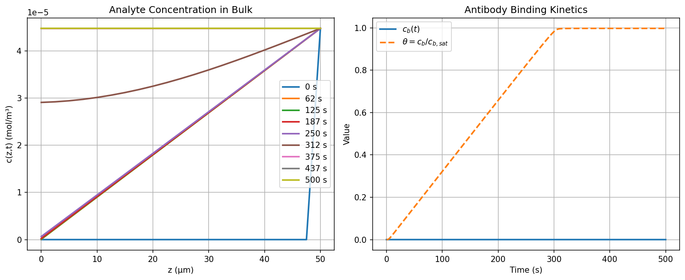

#### Finite Element Method (FEM)
`numerical_methods/antibody_fem.py`

| | |
|---|---|
| 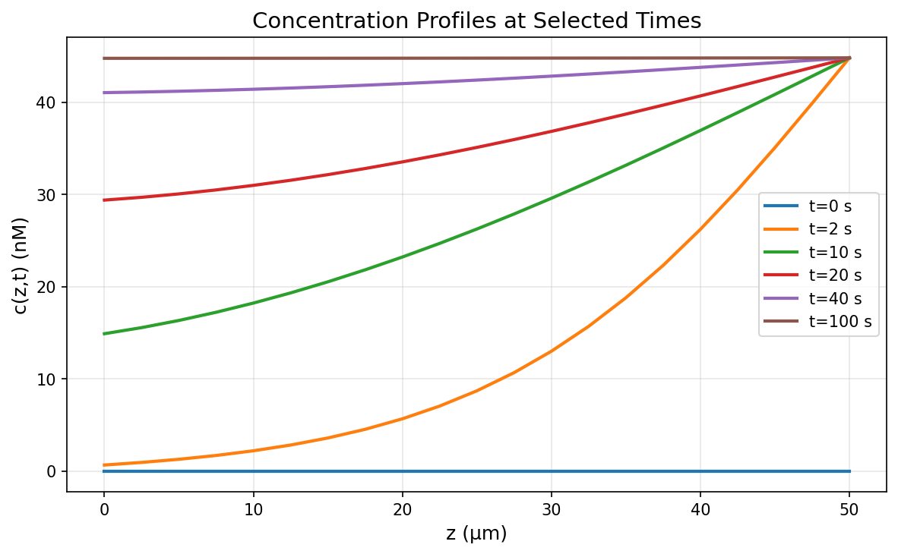<br>Concentration profiles at selected times | 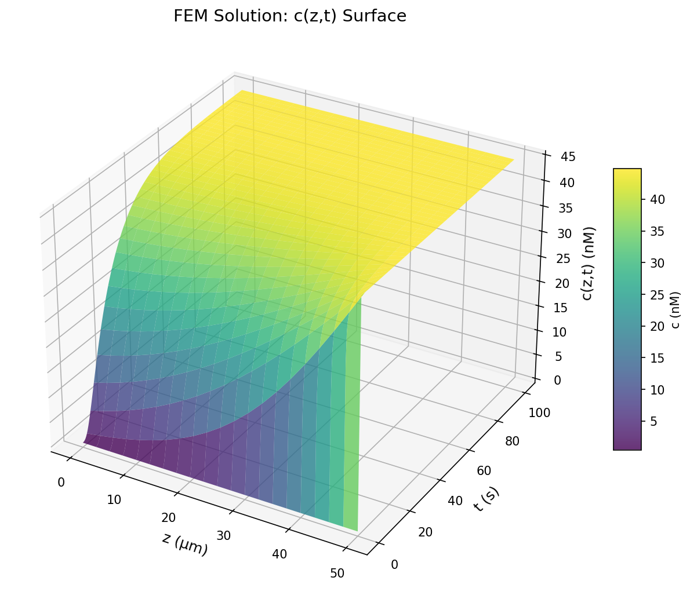<br>Full space-time solution surface c(z,t) |

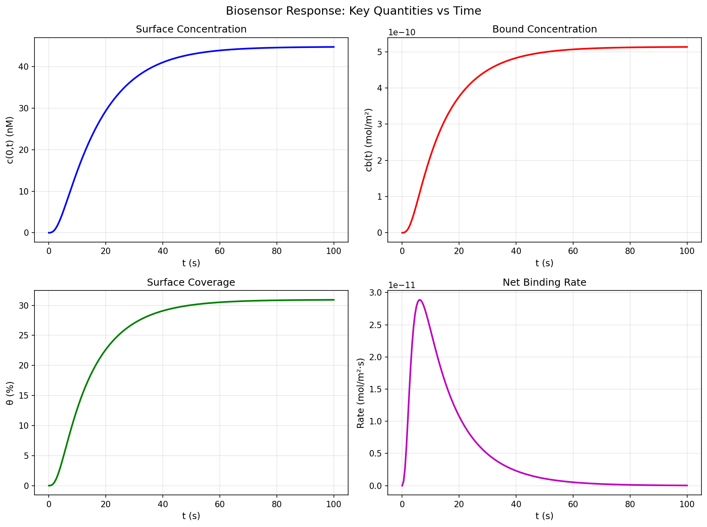
*Surface concentration, bound concentration, coverage, and net binding rate over time.*

#### Physics-Informed Neural Network (PINN)
`machine_learning/pinn_model.ipynb`

| | |
|---|---|
| 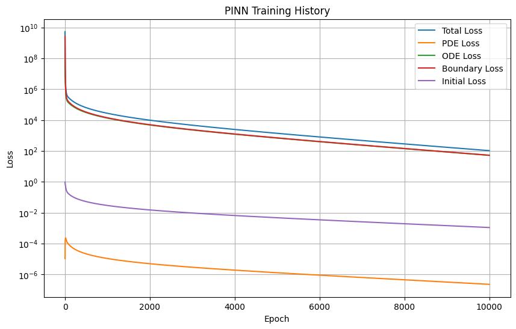<br>Training history | 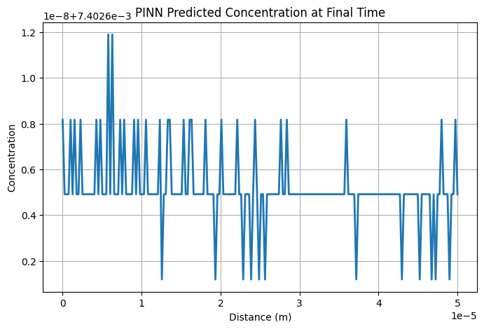<br>Predicted concentration at final time |
| 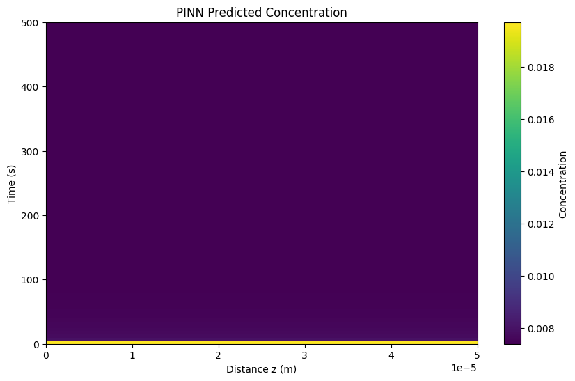<br>Predicted concentration field (z, t) | 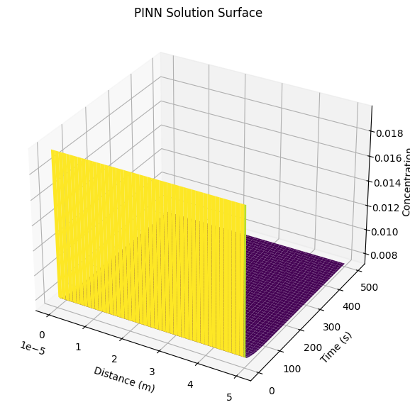<br>Solution surface |
| 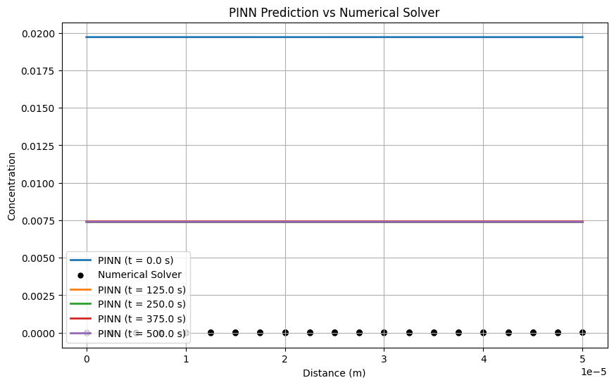<br>Prediction vs. numerical solver — concentration | 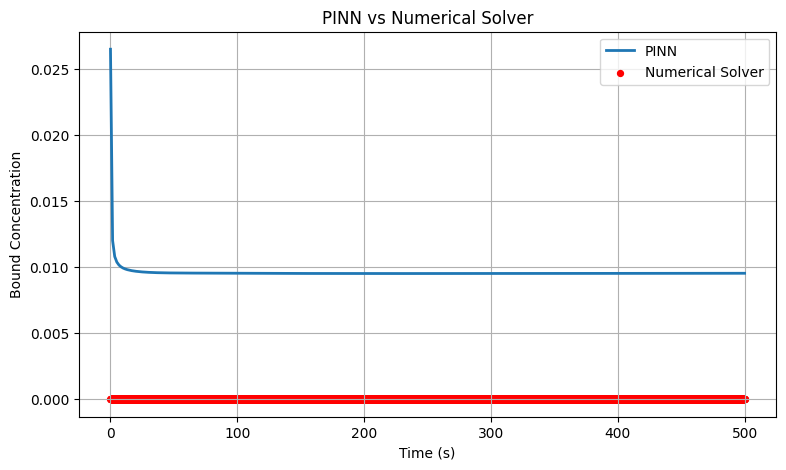<br>Prediction vs. numerical solver — bound concentration |

#### DeepONet
`machine_learning/deeponet.ipynb`

| | |
|---|---|
| 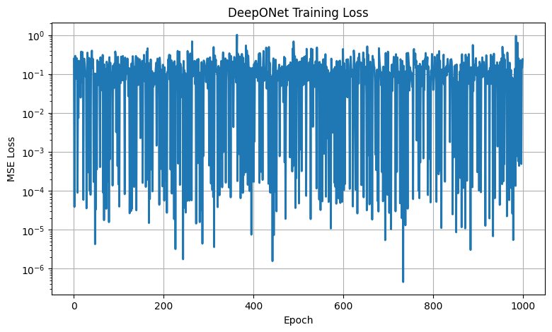<br>Training loss | 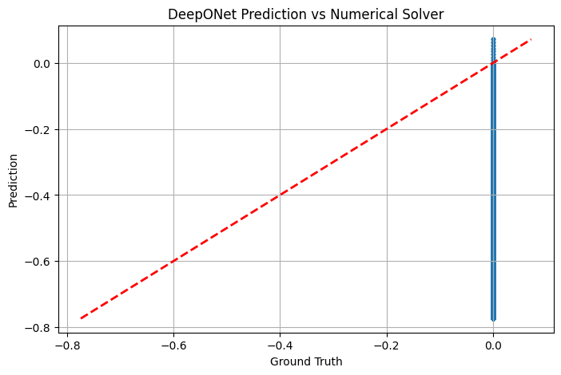<br>Prediction vs. ground truth |
| 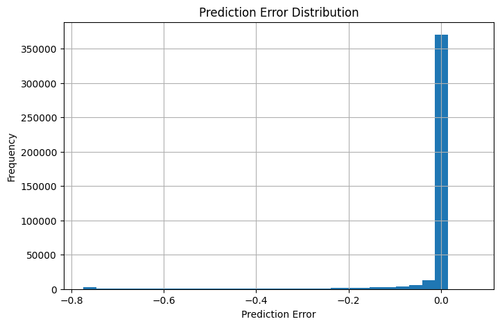<br>Prediction error distribution | 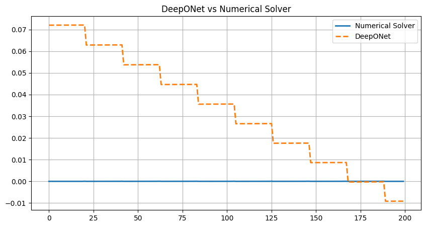<br>Prediction vs. numerical solver |

#### Graph Neural Network (GNN)
`machine_learning/gnn_model.ipynb`

| | |
|---|---|
| 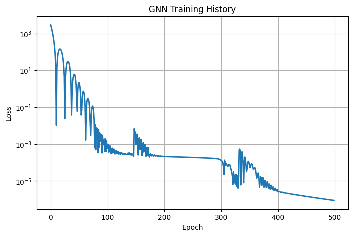<br>Training history | 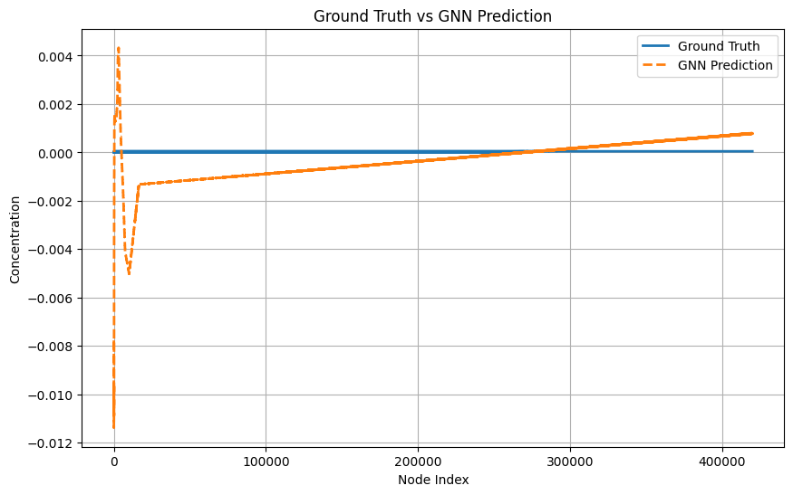<br>Ground truth vs. prediction |
| 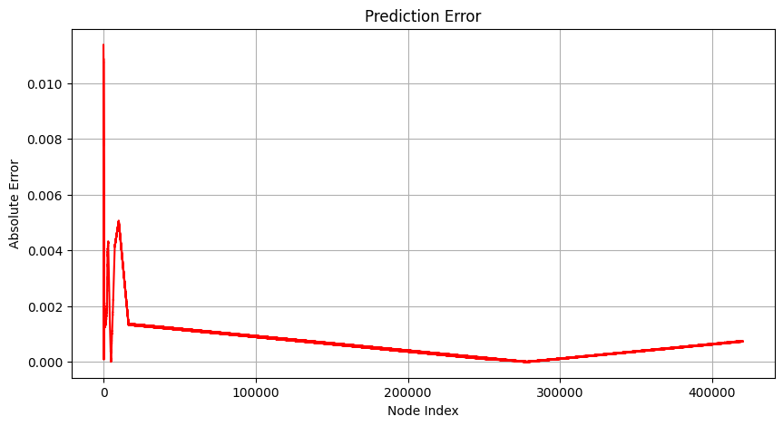<br>Prediction error by node | 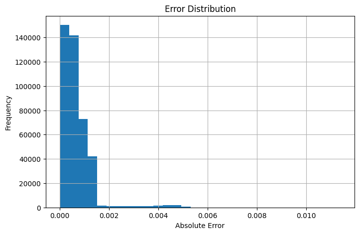<br>Error distribution |

## Getting Started

```bash
# Clone the repository
git clone <repo-url>
cd Antibody-Binding-Kinetics

# Install dependencies
pip install -r requirements.txt

# Run the classical numerical solvers
python numerical_methods/coupled_system.py
python numerical_methods/antibody_fem.py

# Explore the machine learning notebooks
jupyter notebook machine_learning/
```

> Note: the notebooks were developed for Google Colab and include
> Colab-specific cells (e.g. `google.colab.drive` mounting). Remove or adapt
> these cells to run locally.

## Future Work

- [ ] Improve prediction accuracy using larger datasets
- [ ] Extend the model to three-dimensional domains
- [ ] Explore additional deep learning architectures
- [ ] Optimize computational performance

## Authors

| Name | Role |
|---|---|
| Mohab Hisham | Biomedical Engineering |
| Ahmed Hatem | Biomedical Engineering |
| Ahmed El Manzalawi | Biomedical Engineering |
| Fatma Saied | Biomedical Engineering |
| Salma Khaled | Biomedical Engineering |

**Academic Supervisor:** Dr. Mohamed Rushdy
**Course:** SBE 601 — Numerical Methods in Biomedical Engineering
**Department:** Systems and Biomedical Engineering

## License

This project is released under the [MIT License](LICENSE).

---

<div align="center">
<sub>Built with 🧬 for SBE 601 — Numerical Methods in Biomedical Engineering</sub>
</div>
